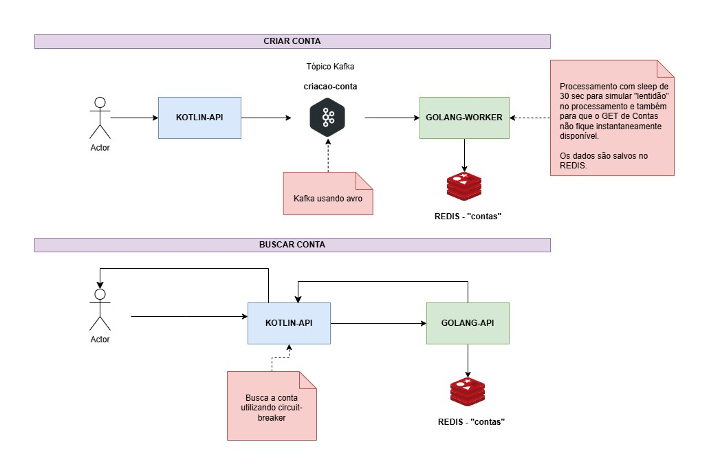

# Golang Api e Worker

API e Worker desenvolvidos em Golang para praticar a linguagem de programação com Kafka, web e Redis.

Consiste em 2 pacotes em Go

- `Worker`: recebe mensagens Kafka do tópico `criacao-conta`, processa eles e salva os dados em um banco de dados REDIS.
- `API`: le todos os dados no REDIS e retorna eles como uma lista em JSON para consulta.

Visão simplificada: 




## Como rodar

### 1) Kafka e Redis

É preciso que um server Kafka e Redis estejam disponíveis para uso.

Na pasta `dockercompose` tem um arquivo `docker-compose.yml` com a infra necessária para rodar ambos Worker e API.

### 2) Rodar o worker

É preciso rodar worker que se encontra na pasta `worker`. Basta rodar:

```bash
go run worker.go
```

Para inserir dados para o worker processar, é preciso realizar as requisições de criação de conta na aplicação Kotlin.

### 3) Rodar a API

É preciso rodar a API que se encontra na pasta `api`. Basta rodar:

```bash
go run api.go
```

Para consultar a API, basta acessar o endereço `GET` de `http://localhost:8085/contas`.


## Aplicação Kotlin

TODO: adicionar o link